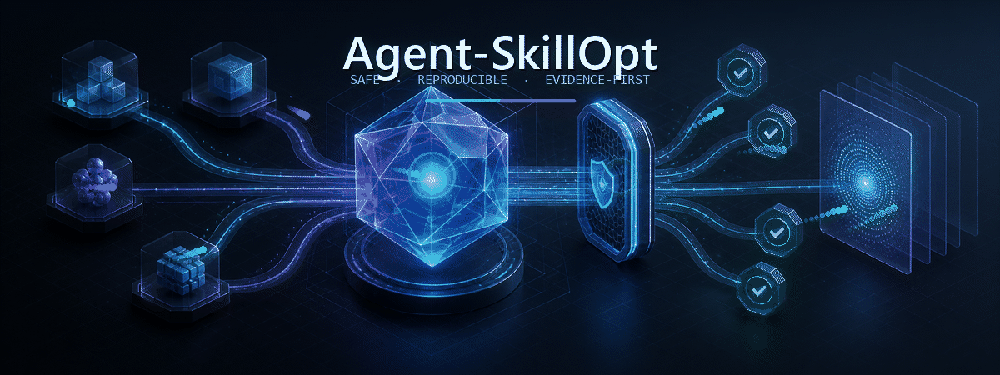

<div align="center">
  
</div>

<h1 align="center">Agent-SkillOpt</h1>

<p align="center">用一次明确确认，创建并离线验证可移植的四宿主 Skill 包</p>

<p align="center">
  <a href="https://github.com/naipi11/Agent-SkillOpt/actions/workflows/ci.yml"></a>
  
  <a href="LICENSE"></a>
</p>

Agent-SkillOpt 是中文优先的离线 Skill 创作器：一个可移植的 [Agent Plugins v1
核心](https://agent-plugins.org/specification)，加四个薄适配面——Codex marketplace、Claude
Code marketplace、Hermes Agent 便携包、OpenClaw 兼容包发现。创建和验证不会发起网络、读取
secret、安装依赖或执行生成 Skill 的脚本。

## 安装当前 Agent-SkillOpt 插件

本节安装的是此仓库已发布的 `agent-skillopt` 插件本身，而非下文示例中由它创建的
`release-notes` bundle。以下命令会访问网络并改变对应宿主的用户级 marketplace、缓存、插件
状态或网关；请先审查 `naipi11/Agent-SkillOpt`，再逐条执行。已发布 `v0.2.1` 的本机实际安装快照、
CLI/清单契约、未验证宿主和恢复边界，均记录在[兼容性矩阵](docs/compatibility.md)；它们不等同于
Skill 脚手架在任意项目或任意宿主中已经运行成功。

### Codex

```powershell
codex plugin marketplace add naipi11/Agent-SkillOpt --ref 9a3c9e1765a5ff0561af5221906879670f5c4536
codex plugin add agent-skillopt@agent-skillopt
```

### Claude Code

```powershell
claude plugin marketplace add naipi11/Agent-SkillOpt --scope user
claude plugin install agent-skillopt@agent-skillopt --scope user --yes
```

本机的 `v0.2.1` 已在 user scope 安装并启用；Claude Code 报告安装/更新后需要重启才能加载，
因此安装元数据不等同于当前会话已经加载或 Skill 已实际运行。

### Hermes Agent

Hermes 的远程安装应固定到精确的 40 位 commit SHA。本机已用已发布 `v0.2.1` 的 commit
`9a3c9e1765a5ff0561af5221906879670f5c4536` 完成安装、检查和启用：

```powershell
hermes plugins install naipi11/Agent-SkillOpt --ref 9a3c9e1765a5ff0561af5221906879670f5c4536 --no-enable
hermes plugins show agent-skillopt
hermes plugins enable agent-skillopt
```

该实例保持 `allow_tool_override: false`，并在下一次 Hermes session 生效；安装成功不等同于
已在新 session 中实际运行。

### OpenClaw

本机未安装 OpenClaw CLI，因此下列是按本地、已验证 bundle 根目录的兼容流程记录，**不是本机
安装成功证据**。将 `<bundle-root>` 替换为经 `validate` 验证过的绝对目录，再在目标环境执行：

```text
openclaw plugins install <bundle-root>
openclaw plugins inspect agent-skillopt
openclaw gateway restart
```

`main` 是可变分支，后续提交可能改变同一 ref 的内容。Codex 当前本地 CLI 的 `--ref` 可指定 ref；
Claude 的 GitHub 简写使用默认分支（当前为 `main`）。不要把两者当作相同的 ref 语义。
Claude 的远程 marketplace source 使用 branch/tag ref，不承诺能以 commit SHA 固定安装。release tag
也只是 Git ref，不天然不可变：只能在受保护且受信任时使用，并应在 release notes 中记录、复核其
解析出的 40 位 commit SHA，以审计并确认精确内容身份。依据 Claude Code 官方插件契约，Git
marketplace 可能会按其设置在后台刷新；初始配置后，即使没有新的明确用户命令，也可能发生远程获取。
显式安装或更新同样会访问网络并改变宿主状态。本机在 2026-08-25 完成的安装状态快照见
[兼容性矩阵](docs/compatibility.md)，其中的单机结果不能泛化为所有版本或宿主。安装后的脚手架实际执行时需要 Python 3.10+；仅完成
marketplace 获取并不等同于已经运行脚手架。

### 失败时的检查与恢复

上述多步骤安装**不是原子事务**：marketplace 已添加而 plugin install 失败、Hermes 已下载而尚未
enable、或 OpenClaw 已安装但 gateway restart 失败，都可能留下部分状态。先停止后续步骤，再进行
只读检查：Codex 使用 `codex plugin list`，Claude Code 使用 `claude plugin list`，Hermes 使用
`hermes plugins show agent-skillopt`。确认实际状态和错误原因后，按该宿主官方文档移除残留 marketplace/
plugin 或重试缺失步骤；不要在未检查状态时重复整组命令。OpenClaw 未在本机验证，本文不杜撰其检查或
移除命令；请仅参照目标环境的 OpenClaw 文档和其实际输出恢复。

### 维护者发布规则

`pyproject.toml`、`src/agent_skillopt/__init__.py`、`plugin.json`、`.codex-plugin/plugin.json` 和
`.claude-plugin/plugin.json` 当前都声明静态版本 `0.2.1`。以后发布会改变远程插件内容的提交时，必须将
这五处版本同步递增并在发布说明中记录解析后的 40 位 commit SHA；否则已安装宿主可能继续把它视作同一版本而不更新。

## 本地生成 Skill 的安全工作流

创建新的本地生成 Skill 包时，流程是：自然语言 brief → stdin `preview` → 检查返回的目录、文件、token →
**一次明确确认** → 精确 `apply` → 离线 `validate` → 为所选宿主渲染 `install`。实际宿主执行
是单独的外部状态变更，必须再次明确请求并提供与新安装计划匹配的 token。

以下是「写发布说明」的本地 preview。源检出中 `$skillDirectory` 是仓库的绝对路径；在已安装
插件中，必须改为当前所用 `SKILL.md` 所在的绝对目录，不能假设当前目录或检出位置。

```powershell
$skillDirectory = (Resolve-Path .\skills\agent-skillopt).Path
$bundleRoot = Join-Path (Get-Location) 'out\release-notes'
$spec = @'
{
  "name": "release-notes",
  "description": "从已核实的变更起草简洁发布说明。",
  "body": "先收集已核实的变更，再起草发布说明。",
  "output_directory": "REPLACE_WITH_ABSOLUTE_BUNDLE_ROOT"
}
'@.Replace('REPLACE_WITH_ABSOLUTE_BUNDLE_ROOT', $bundleRoot.Replace('\\', '\\\\'))
$spec | python "$skillDirectory\scripts\scaffold_bundle.py" preview --spec -
```

检查返回 JSON 的 `output_directory`、`files` 和 `confirmation_token`。预览不会创建输出目录；
可选 resource 没有顶层 `resources` 字段，而是 `files` 中的资源路径条目。只有它们完全正确时，
才原样使用该 token：

```powershell
$spec | python "$skillDirectory\scripts\scaffold_bundle.py" apply --spec - --confirm <preview-token>
python "$skillDirectory\scripts\scaffold_bundle.py" validate --path "$bundleRoot"
```

`apply` 不覆盖现有目录。它在同级唯一 staging 目录写入并验证，随后才无覆盖发布；失败会清理
自己的 staging（受系统锁阻止时会报告残留路径）。验证失败时不要安装。

## 仅渲染安装计划

Codex、Claude 和 OpenClaw 的本地包计划不需要 source；下面命令只返回 argv 数组、网络标记和
安装 token，属于 **PLAN ONLY**：

```powershell
python "$skillDirectory\scripts\scaffold_bundle.py" install --host <codex|claude|openclaw> --path "$bundleRoot"
```

Hermes 必须提供明确的 `<owner>/<repository>` Git source；这同样只渲染计划，不访问网络或执行宿主命令。
可选的 `--source-ref` 仅接受精确 40 位 commit SHA，并把它映射为随后 Hermes 命令的 `--ref`：

```powershell
python "$skillDirectory\scripts\scaffold_bundle.py" install --host hermes --path "$bundleRoot" --source <owner>/<repository> --source-ref <40-char-sha>
```

每一步是一个 argv 元组，路径永远是一个参数而不是 shell 拼接。`<bundle-root>` 必须替换为
已经 preview/validate 的绝对目录，`release-notes` 替换为规范化包名；以下命令严格对应
`build_install_plan` 的渲染：

| 宿主 | 计划 argv（只能在后续独立确认后执行） |
| --- | --- |
| [Codex](https://help.openai.com/en/articles/20001256-plugins-in-codex/) | `codex plugin marketplace add <bundle-root>`<br>`codex plugin add release-notes@release-notes` |
| [Claude Code](https://code.claude.com/docs/en/plugins-reference) | `claude plugin marketplace add <bundle-root>`<br>`claude plugin install release-notes@release-notes` |
| [Hermes Agent](https://hermes-agent.nousresearch.com/docs/developer-guide/plugins) | `hermes plugins install <owner>/<repository> --ref <40-char-sha> --no-enable`<br>`hermes plugins enable release-notes` |
| [OpenClaw](https://docs.openclaw.ai/plugins/bundles) | `openclaw plugins install <bundle-root>`<br>`openclaw plugins inspect release-notes`<br>`openclaw gateway restart` |

Hermes 需要明确的 `<owner>/<repository>` Git source（不是裸索引名、本地路径或 URL），会访问网络且远程内容可变；
`--source-ref` 可选但建议使用，并且只能是精确 40 位 commit SHA。**Hermes Git install/enable
和 OpenClaw gateway restart 都是外部状态变更，绝不能因“渲染计划”自动执行。** Codex 与
Claude 的 marketplace/add/install 也会改变用户级宿主状态。安装 token 绑定宿主、已验证路径、
内容快照、命令及 Hermes source，但不 pin 远端 commit，也不能替代权限和来源审查。

## 本地验证

```powershell
python -m compileall src
python -m pytest tests -v
python scripts/validate_bundle.py .
python -m ruff check src tests
```

CI 在 Windows 与 Ubuntu 的 Python 3.10、3.12 执行离线检查，且不会下载宿主 CLI。请阅读
[兼容性矩阵](docs/compatibility.md)、[安全边界](docs/security.md) 与
[0.2.0 迁移说明](docs/migration-v0.2.md)。许可证：MIT。
